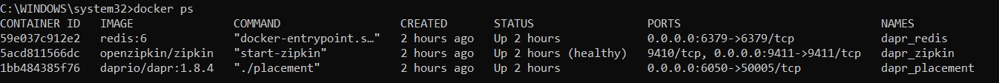

# microsoervices-example

The repository shows how to run a microservice ecosystem, making all steps one by one in order to

- check requirements
- configure each microservice
- set the communication
- deploy all together

## Ecosystem

The projects are:

- data-gateway
- data-package-service
- client-data-sender
- client-data-receiver

## Requirements

Install **Docker Desktop** and **Dapr** and execute:

	docker ps

in order to check if the below containers are running:

- dapr_redis
- dapr_zipkin
- dapr_placement

# Step by step

The below paragraphs describe the development to aim the goal, running a microservice ecosystem.

## data-gateway

the project is an aspnet core web api service.

- It exposes the */data/* endpoint for Post verb in order to send an integer in the body.
- It publishes an event in a message broker.

From the project folder, running:

	dapr run --app-id data-gateway --app-port 5019 --dapr-http-port 5020 dotnet run

the *--app-id* provides the possibility to discover the service through the name.

The *--app-port* says to *Dapr* on which port the service runs and discover it.

The *--dapr-http-port* set the endpoint port for thr *Dapr* sidecar to access the service.

## client-data-sender

The project is a .net core console application. How it works:

- It increments a counter in a loop, saving the value in a store everytime. Once the app goes down and up again, the state is read and the counter is set to the last value.
- It calls the data-gateway service in order to send the counter to the web api.

In order to do that, the app uses the *Redis* container set by Dapr initialization.

From the project folder, running:

	dapr run --app-id client-data-sender dotnet run

the app runs, using the default Redis store configuration in:

	C:\<<user>>\.dapr\components\statestore.yaml

To use the configuration folder under *components* folder, the command is:

	dapr run --components-path ./components/ --app-id client-data-sender dotnet run

## data-package-service

The project contains an aspnet core web api service, listening for an event comes from a message broker.

Once the event arrives, the service sends the data to all connected clients.

Under the folder project, running:

	dapr run --app-id data-package-service --components-path ./components/ --app-port 5081 dotnet run

## client-data-receiver

The project is a .net core console application. How it works:

- It receives events with a payload data by the *data-package-service*.

From the project folder, running:

	dapr run --app-id data-package-service dotnet run

# Tye

Tye is an microservices orchestrator for developing mode. See tye.yaml to check the microservices configuration.

From the solution folder, running:

	tye run

The command runs all microservices configured in the yaml file.

After that, run *client-data-receiver* manually in order to check if the data arrives from the cycle.

*Note*: in the *tye.yaml*, see the port for *client-data-sender*. It is the same of *data-gateway*.

## docker-compose

# References

## Dapr

### State Management

### Service Invocation

- <https://docs.dapr.io/developing-applications/building-blocks/service-invocation/howto-invoke-discover-services/>

### PubSub

- <https://docs.dapr.io/developing-applications/building-blocks/pubsub/howto-publish-subscribe/>
- <https://yourazurecoach.com/2019/12/27/exploring-dapr-pub-sub-part-2-asp-net-core-integration/>
- <https://medium.com/@__hungrywolf/microservices-pub-sub-with-dapr-docker-compose-and-net-1e5be05ada1a>

## docker-compose

- <https://medium.com/@__hungrywolf/microservices-service-to-service-to-invocation-with-dapr-and-net-22f2e0be2779>